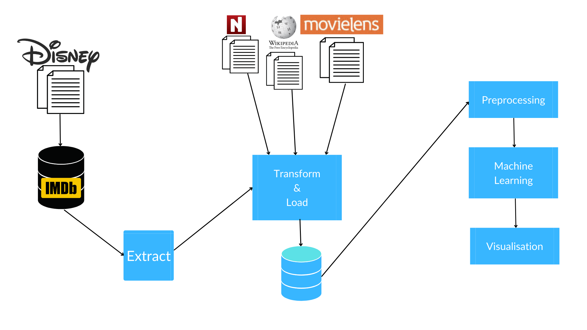
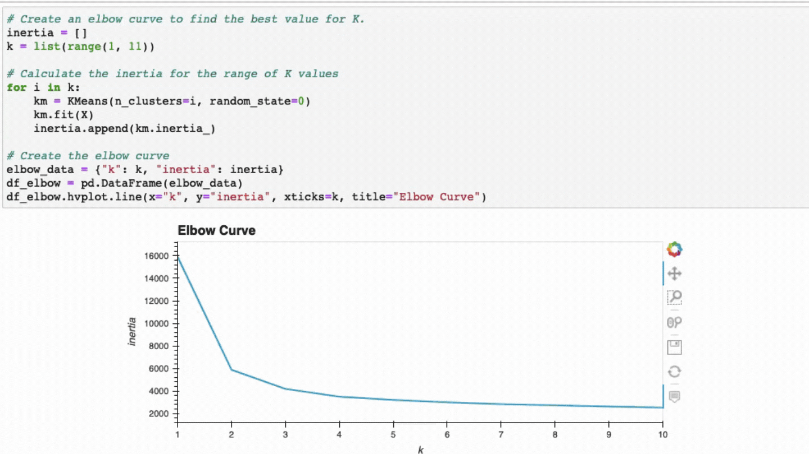
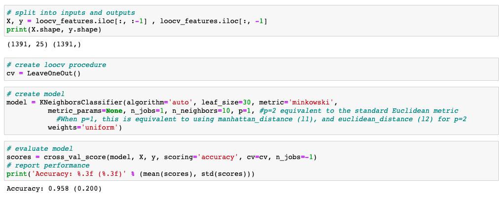

## Project Overview

Disney's initial source of revenue begins with movies and TV shows. Unfortunately this is not a sustainable model, as studio production has a very short revenue lifespan. A new movie will at best provide income for a few months and then Disney will need to move on the next project.

But what if we could extend that revenue lifespan? What if we could leverage the many Disney intellectual properties and continue to earn revenue for an extended amount of time after the initial movie release.?

Disney can release a variety of merchandise (toys, video games, apparel, etc) based on their movies. As well as new themes for Disney Parks attractions.
These merchandise and attractions will provide Disney with a steady and predictable stream of revenue with no expiration. 

Therefore, we have implemented 2 Machine Learning (ML) models to help us understand how to generate revenue on the verticals mentioned above.

### Why We Selected This Topic

When we looked at the revenue figures, it is very clear that the box office revenue is just the starting point in Disney's revenue.

However, revenues derived from franchises, collaborations merchandise sales and Disney Parks are just as important.

The charts below shows that 'Disney Studios Revenue' from movies is just one of the many business groups within Disney. Revenues from the other business groups have exponentially grown over the years and helps Disney diversify its revenues portfolio. This in turn creates a longer, more reliable and sustainable revenue model.

### How Will the Machine Learning Models Assists in Other Business Verticals?

Our ML models shows that movies grouping (or clusters) and their closest corresponding neighbours.

* Assume our first ML model shows that **Toy Story** is the closest neighbour to **Lion King** and the genre is **Adventure** and MPAA rating **Teen**

	* This tells us that our target audience are teenagers and older witn an adventurous mindset.

		* As a result any merchandise or rides we make based on these movies have to be catered towards that demographic.

			* The rides will be more thrilling like rollercoaster, instead of an easy ride.

			* The merchandise will action figures, instead of dolls. 

			* Potential new video games will be adventure games, instead of puzzle games.

Through the help of data and ML models we can make informed business decisions which greatly mitigates risk and increases our probability of success. 

### How Can the Machine Learning Models Help in Business Decisions?

* Traditional and digital marketings will be targeted at specific groups making it more cost-efficient and yield higher success rate.

* When building new attractions at Disney World, we now have a deeper understanding of what the target group prefers, example, a more thrilling rollercoaster ride versus an easy going one. 

* We are able to build the rides at the right location, example 'Toy Story' and 'Lion king' rides closer to each other. This will encourage more visitors to buy tickets for both the rides due to the close proximity.

* Since we know the closest movie neighbours we can use this information for product placement, example Lion King merchandise beside Toy Story merchandise, where customers are likely to buy both and ultimately increasing our merchandise sales.

### Questions the Team Wants to Answer

1. How are the movies grouped and what kind of similarities pattern do they exhibit?
2. Which movies are closely grouped together, indicated by a certain granularity.

## Presentation

The presentation is available on Google Drive: 

https://docs.google.com/presentation/d/1gSYWireJf50b5sNvhDKRBgWYFzsNaZfnyKBFj-jwRu4/edit?usp=sharing  

## Data Analysis and Visualization

### Tableau Dashboard

#### Disney's Revenue by Business Groups

https://public.tableau.com/app/profile/akinfolarin8600/viz/DisneysRevenuebyBusinessLine-Dashboard/DisneysRevenuebyBusinessLineDashboard?publish=yes

#### Disney's Movies Revenue

https://public.tableau.com/app/profile/akinfolarin8600/viz/DisneyRevenueStory/DisneyRevenueStory?publish=yes

### Data Exploration

#### WEEK 1 to WEEK 2
The first datasets are from Kaggle.com. After the initial Exploratory Data Analysis (EDA) on multiple datasets, we discovered high inconsistencies within the data. The data was incomplete, messy and did not yield good results after parsing through the first ML model. 

#### WEEK 3 to WEEK 4

Therefore, from week 3 onwards, we collected our data directly from the source with the methods below:

* **IMDb** - API
* **Wikipedia** - Web scrape
* **MovieLens** - research dataset from https://grouplens.org/datasets/movielens/
* **The numbers** - Tried scraping but the website blocked scraping since 2016, so just manually copied some datasets

## Data Source

As mentioned above, we source our data directly from IMDb, Wikipedia and the-numbers.com. We have also used the genres information from MovieLens. 

### Technical Flow Diagram

 

First we collect all the data from the different sources indicated above either through API or web scraping method. Then the data is transformed and loaded into our Postgres database. This newly transformed dataset is then parsed to the K-Means Clustering Model and K-Nearest Neighbor Model. Finally the results are used in the Tableau visualisation. 

## Data Extract

We decided to pivot to using API and web scrape from IMDd and Wikipedia for the latest most comprehensive dataset.
With the new data from IMDb, we were able to use imdbId as our Primary Key and Foreign Key. This is also future proof our stored data as imdbId will always match IMDB database whenever we update new information from IMDB, thus eliminating potential data duplication. This way, the data integrity will always be preserved. 

### Description of the Data

#### Information Collected

The data below spans from _**1937 to 2021**_.

* IMDb: Titles, Release Date, Rated, Metascore, Grammy Awards, Directors, Actors, Languages, Countries, IMDBRatings, IMDBVotes, Genres, imdbId
* Wikipedia: Actors / Voice Actors, Directors, Disney Group Revenues (Disney Parks, Disney Merchandise, Disney Interactive, Disney Studios)
* MovieLens: Titles, Genres
* The-numbers.com:  Titles, Box Office Total Gross, Budget

## Data Transformation and Load

1. The biggest bulk of work in this segment was transforming and aligning all the movie titles discrepencies with Regular Expression. 
2. From the numerous datasets above, we combined and filled NULL values from different sources to enable all the Disney movies to have as much information as possible and reduce NaN in all columns.
3. The chosen data is then cleaned further and cast to their type for database. 

### ERD

The dataset is further normalised for SQL database. See below for a normalised database schema design. The full SQL schema code is available at [SQL SCHEMA](#sql-schema)

## Database

Once the data is ready for database storage, we connect to Postgres with SQL Alchemy and send the data to the designated database. Please see the images below.

### Connect to SQL

### SQL Join

## Machine Learning

### Feature Engineering

#### Features Selection

From the final dataset collected, we have selected these 4 values as our input features:
1. Genres
2. MPAA Ratings
3. IMDB Average Rating
4. IMDB Total Votes (which shows how many people have rated a movie)

While we could also include other features like Actors, Awards and Directors; these features do not have longer consistency as sometimes these people have either retired or passed away. These features can be important if our dataset is larger, in tens of thousands or millions.

#### Features Preprocessing - Binning

Firstly, the dataset we have is imbalance and noisy. Therefore during data preprocessing stage, the outliers were binned for better performance.
* Genres was reduced from _**29 to 22**_
* MPAA Rating was reduced from _**14 to 8**_

#### Features Preprocessing - Encoding

In order for our ML model to process these features, we also need to encode and scale the features, please see below for what we did with each feature:
1. Genres - **OneHotEncoder**
2. MPAA Ratings - **LabelEncoder**
3. IMDB Average Rating - **MinMaxScaler**
4. IMDB Total Votes - **MinMaxScaler**

### Elbow curve

After plotting an elbow curve with the features above, it is clear that there are **3 strong groups** within these movies with the **inertia / coefficient of 4.194e+3 or 4194 in decimal terms.** One of the biggest drawback of this model is the random starting point of the centroids therefore every time this model is executed, the inertia can be a different. However the K remains consistent at 3. Please see below.

 

### K-means Clustering Model

K-means clustering is a type of unsupervised learning, which is used when there is  unlabeled data. The goal of this algorithm is to find groups in the data, with the number of groups represented by the variable K.

As indicated, the K-means Cluster model is generated with **K=3** as seen below. 

With this, we have completed our first ML model using K-means clustering. 

While it fulfills what we need, one of the drawback of K-Means Cluster is the inability to understand why the different movies have been clustered together. Another drawback is there are 3 clusters within this dataset and each clusters have approximately 400 movies. At this point, we are unable to easily conclude which 2 movies are closest together for business decisions like where to build the next park ride or product placement as there is just too many movies in the same group. 

Therefore we have decided to add another ML model to support and strengthen our initial K-means Cluster model. 

### Nearest Neighbour

K Nearest Neighbour (KNN) algorithm can be used for both classification and regression problems. The KNN algorithm uses ‘feature similarity’ to predict the values of any new data points.

Using the same features, encoding and scaler; a KNN model is used to find only the 5 nearest neighbors to one movie. This produces a higher granularity for business decisions like where to build the latest ride in Disney Park. See the image below. 

### Hyper Parameter Tuning

Grid Search uses a different combination of all the specified hyperparameters and their values and calculates the performance for each combination and selects the best value for the hyperparameters. GridSearchCV has all the capabilities of Grid Search and also includes cross-validation. Cross-Validation is used while training the model. As we know that before training the model with data, we divide the data into two parts – train data and test data. In cross-validation, the process divides the train data further into two parts – the train data and the validation data.
We used GridSearchCV to find the best hyper parameters for the KNN model and also for the accuracy score KNN Classifier test. 

## Analysis

### Accuracy Score

While it is not possible to compute accuracy score for unsupervised ML with K-Means Clustering and K-Nearest Neigbors as there are no ground truth labels to measure against, we will still like to understand our ML models' performance. Therefore we have used the K-means cluster classes as the y prediction in order to produce an accuracy score metrics.

Leave One Out Cross-Validation (LOOCV) is a type of cross-validation approach in which each observation is considered as the validation set and the rest (N-1) observations are considered as the training set. In LOOCV, fitting of the model is done and predicting using one observation validation set. Tt results in a reliable and unbiased estimate of model performance.

As our dataset consists of only 1391 movies, this method can be deployed. When the dataset grows beyond tens of thousands, we will need to use a less computationally expensive method for cross-validation. 

Using the same 4 features for the 2 ML models above, LOOCV is used to determine the accuracy of the K-means Cluster class. The results shown below that our model for K-means Cluster and K-Nearest Neigbor has an accuracy of **95.8%.**

 

## Team Communication and Project Methodology

- Team Slack Channel
- Individual Slack Chat
- WhatsApp group
- Google Share Drive
- Zoom meetings
- Agile - Scrum

## Conclusion

### Recommendation for future analysis

* Get user data from IMDB (user ratings and reviews), this will allow us to create a User Recommendation System

* Get merchandise revenue datasets (toys, video games, apparel sales). This would strenthen our analysis and help us compare revenues more effectively.

* Build a Sentiment Analysis System using Natural Language Processing (NLP) for all Disney Park reviews. Due to time constraint, we could not finish this part of the project that we started. The ML model here will give us a 360 understanding of our Disney Parks and improve on any potential shortcomings or problems. 

### Anything the team would have different

* Instead of wasting 2 weeks on Kaggle datasets and EDA, if we had started with API and web scraping, we would have a lot more time to implement additional ML models.

* The time saved from previous point will be used to complete our NLP model on Disney Park reviews. 

## Appendix

#### SQL SCHEMA

CREATE TABLE movies (
	imdb_id varchar   NOT NULL PRIMARY KEY,
	title varchar   NOT NULL,
	year int   NOT NULL,
	rated varchar   NOT NULL,
	released date   NOT NULL,
	runtime int   NOT NULL,
	imdb_rating float   NOT NULL,
	imdb_votes int   NOT NULL,
	genres varchar   NOT NULL
	);

CREATE TABLE language_country (
	lc_id varchar   NOT NULL PRIMARY KEY,
	imdb_id varchar   REFERENCES movies (imdb_id),
	language archer   NOT NULL,
	country varchar   NOT NULL
	);

CREATE TABLE awards (
	awards_id varchar   NOT NULL PRIMARY KEY,
	imdb_id varchar   REFERENCES movies (imdb_id),
	awards archer   NOT NULL
	);

CREATE TABLE metascore (
	ms_id varchar   NOT NULL PRIMARY KEY,
	imdb_id varchar   REFERENCES movies (imdb_id),
	metascore varchar   NOT NULL
	);

CREATE TABLE gross_revenue (
	rev_id varchar   NOT NULL PRIMARY KEY,
	imdb_id varchar   REFERENCES movies (imdb_id),
	total_gross int   NOT NULL,
	inflation_adjusted_gross int   NOT NULL
	);

